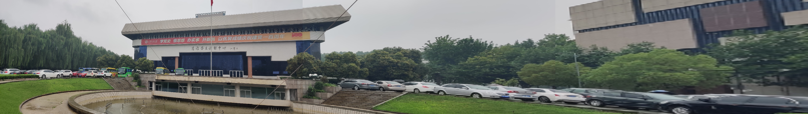

# 全景图像拼接

## Usage
- Env

```shell
$ conda create --name <env> --file requirements.txt
```

- Edit main.py

```python
if __name__ == '__main__':
    # merge img (1) - (4)
    # 1-4 5-8 9-13
    bat_merge(9, 13)
```

- Run

```shell
$ python main.py
```

## Result




